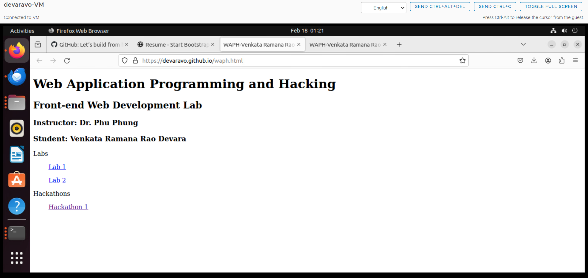
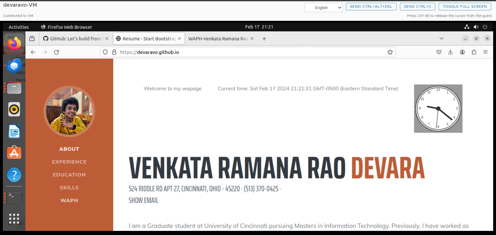
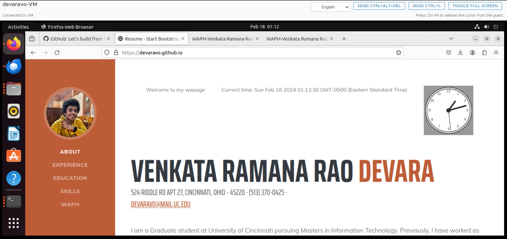
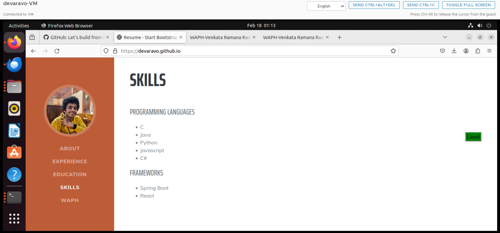
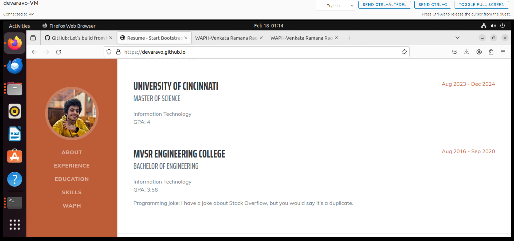
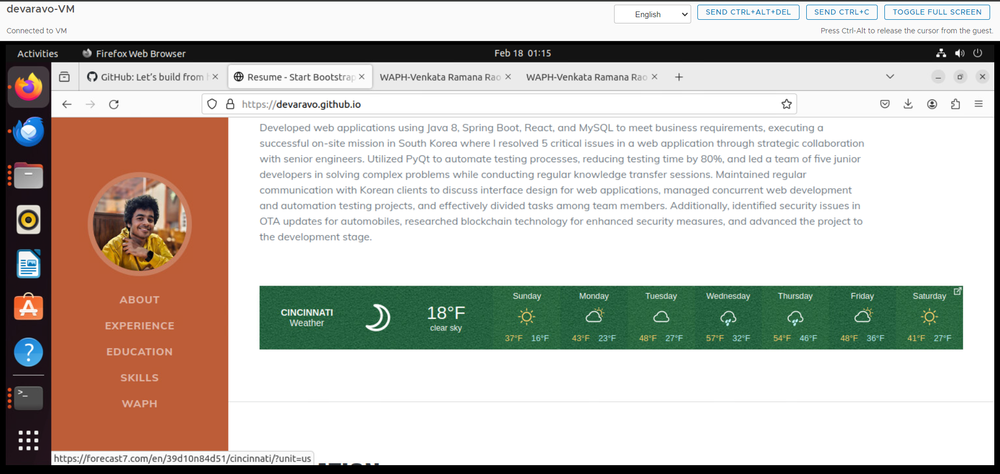
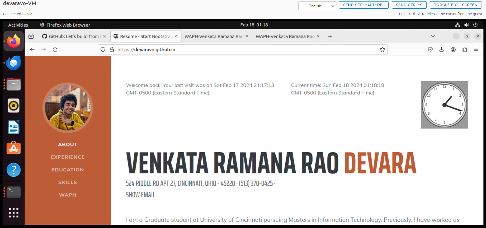

# WAPH - Web Application Programming and Hacking

## Instructor: Dr. Phu Phung

## Student
**Name**: Venkata Ramana Rao Devara\
**Email**: devaravo@mail.uc.edu \


\

## Repository 
**Repository URL**: [https://github.com/devaravo/devaravo.github.io](https://github.com/devaravo/devaravo.github.io).

## Professional Webpage
**Webpage URL**: [https://devaravo.github.io/](https://devaravo.github.io/).

## Individual Project 1: Front-end Web Development with a Professional Profile Website on github.io 

This project covers building a cprofessional profile webpage using bootstrap and integrating various features such as javascript functionalities, google analytics, integration of web APIs and cookies.

### General requirements
- Created a new public repository devaravo.github.io
- Cloned the repository in VM and added index.html and waph.html
- Built a html profile webpage highlighting my skills, experience and education
- Created a link to waph.html which shows course information and related labs/hackathons etc.
- 

### Non-technical requirements
- Used existing Bootstrap template and updated profile webpage
- 
- Created a new account in google analytics
- Included my webpage (devaravo.github.io) in google analytics and started tracking
- Included the code given by google analytics in my index.html (after closing head element)
```
<!-- Google tag (gtag.js) -->
  <script
    async
    src="https://www.googletagmanager.com/gtag/js?id=G-ECDL71TG52"
  ></script>
  <script>
    window.dataLayer = window.dataLayer || []
    function gtag() {
      dataLayer.push(arguments)
    }
    gtag("js", new Date())

    gtag("config", "G-ECDL71TG52")
  </script>
```

### Technical requirements

#### Basic Javascript code

- Included javascript code for displaying digital clock (included jQuery to get digital clock element)
- 
- Included javascript code for displaying analog clock
- 
- Included javascript code to show/hide email
- 
- 
- Added react libraries in index.html and included React code which displays "Like" button
- 

#### Two public Web APIs integration
- Added joke API and displayed it on webpage using jQuery
- 
- Searched for weather apis on google and added the code given by weathereidget.io to display graphic weather
- 

#### Javascript cookies
- Added code which uses cookies to display the date/time of user's last visit
```     
        if (document.cookie.indexOf("username") <0 ){
        
        $("#lastVisit").html("Welcome to my wepage ")
            document.cookie = "username=user"+"currentTime="+new Date();
        }else{
            let cookieString = document.cookie.split("currentTime=")[1].split(";")[0]


            $("#lastVisit").html("Welcome back! Your last visit was on "+cookieString);
            document.cookie = "username=user"+"currentTime="+new Date();
        }

```

- 

